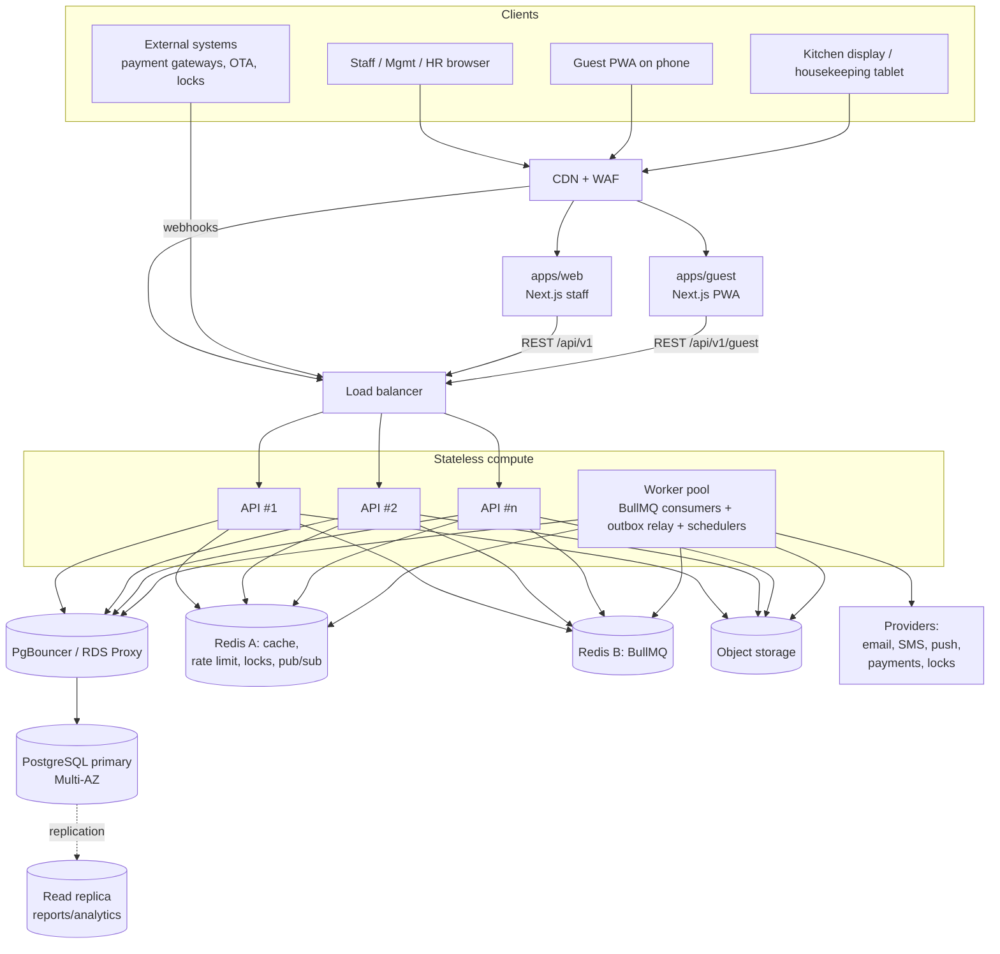
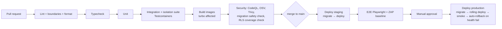

# Production System Blueprint — Multi-Tenant Cloud Hotel Platform

|        |                                                                                                                                                |
| ------ | ---------------------------------------------------------------------------------------------------------------------------------------------- |
| Status | **Accepted with defaults.** The §28 decisions use the proposed defaults ([ADR-0001](../adr/0001-launch-decisions.md)). Phase 0 is implemented. |
| Date   | 2026-09-27                                                                                                                                     |
| Scope  | Architecture. Implementation decisions are in [docs/adr](../adr/).                                                                             |

This document is the answer to the spec's "first response" requirement (§83). It is written to be kept in the repo and updated as decisions land. Where I think the spec should change, I say so and give the reason. Those points are marked **⚠ Spec adjustment**.

---

## Contents

1. [Executive architecture summary](#1-executive-architecture-summary)
2. [Multi-tenant strategy](#2-multi-tenant-strategy)
3. [Organization / property hierarchy](#3-organization--property-hierarchy)
4. [Technology stack](#4-technology-stack)
5. [System architecture diagram](#5-system-architecture-diagram)
6. [Domain / module architecture](#6-domain--module-architecture)
7. [Database architecture](#7-database-architecture)
8. [Tenant isolation strategy](#8-tenant-isolation-strategy)
9. [RBAC and property-scoped permissions](#9-rbac-and-property-scoped-permissions)
10. [Authentication architecture](#10-authentication-architecture)
11. [Guest architecture](#11-guest-architecture)
12. [PMS architecture](#12-pms-architecture)
13. [HR architecture](#13-hr-architecture)
14. [F&B architecture](#14-fb-architecture)
15. [Billing architecture](#15-billing-architecture)
16. [Notification architecture](#16-notification-architecture)
17. [Event-driven architecture](#17-event-driven-architecture)
18. [API architecture](#18-api-architecture)
19. [Infrastructure architecture](#19-infrastructure-architecture)
20. [Security architecture](#20-security-architecture)
21. [Backup / DR strategy](#21-backup--dr-strategy)
22. [Observability](#22-observability)
23. [Testing architecture](#23-testing-architecture)
24. [CI/CD](#24-cicd)
25. [Development roadmap](#25-development-roadmap)
26. [Major architectural risks](#26-major-architectural-risks)
27. [Recommended mitigations](#27-recommended-mitigations)
28. [Decisions to confirm before implementation](#28-decisions-to-confirm-before-implementation)

---

## 1. Executive architecture summary

The platform is a **modular monolith**: one NestJS API and one worker process built from the same domain modules. It runs on **one shared PostgreSQL database** in which every tenant-owned row carries `organization_id`. Isolation is enforced three times over:

1. The **application layer**: a trusted request context, a permission check on every endpoint, and property scope checks.
2. **PostgreSQL Row-Level Security**: a fail-closed backstop keyed on a per-transaction setting.
3. **Composite foreign keys**: a child row cannot point at a parent in a different organization.

Everything else follows a few firm rules:

- **Financial and operational correctness lives in the database.** Exclusion constraints prevent overlapping room assignments. Atomic inventory counters stop overselling. The folio is an append-only ledger with amounts in integer minor units and a currency on every row. Idempotency keys cover every external or retryable write.
- **Asynchronous work goes through a transactional outbox, then BullMQ.** A domain event is never lost when the business transaction commits and is never published when it rolls back.
- **Each property has its own time zone, currency, locale and business date.** Timestamps are stored in UTC. Hotel "days" are property-local `date` values advanced by a **night audit**.
- **External vendors sit behind adapter interfaces.** This covers payments, room access, SMS/email, OTA and biometrics.
- **Guests and staff are separate authentication realms.** They use different session cookies, different apps and different permission models.
- **Growth path:** 1 → 50 properties works on one well-sized Postgres primary with a read replica. At 50 → 500+ properties, move to **cells**: several identical stacks, each serving a set of organizations, with a small global routing/identity layer. The schema already carries `organization_id` everywhere, so moving a tenant between cells is a data-copy operation, not a rewrite.

---

## 2. Multi-tenant strategy

### 2.1 Options considered

| Model                                       | Isolation                              | Cost / ops                                            | Cross-property reporting | Verdict                                          |
| ------------------------------------------- | -------------------------------------- | ----------------------------------------------------- | ------------------------ | ------------------------------------------------ |
| Database per tenant                         | Strongest                              | High: N migrations, N pools, N backups                | Hard (cross-DB)          | Keep as a **premium option later** through cells |
| Schema per tenant                           | Strong                                 | Medium-high: migrations × N, Prisma handles it poorly | Hard                     | Rejected                                         |
| **Shared schema + `organization_id` + RLS** | Strong when RLS is enforced and tested | Low                                                   | Natural (in-org SQL)     | **Chosen**                                       |

### 2.2 The chosen model

- **Tenant = Organization.** An organization is the hard security boundary. No query path may ever return rows from two organizations, except in platform-operator tooling (§20.6).
- **Property is a soft boundary inside the tenant.** The application enforces it through RBAC scope. It is not a separate database boundary, because group users legitimately need cross-property queries.
- **Cells (future).** A `cell` is a complete deployment: API, worker, Postgres and Redis. A thin global service maps `organization_id → cell` and hosts global identity. Adding a cell is how we scale past one database. It also lets a large or regulated customer have a dedicated database without a new code path.

---

## 3. Organization / property hierarchy

```
Platform (SaaS operator)
└── Organization / Tenant              ← hard isolation boundary
    ├── Brand (0..n, optional)         ← marketing grouping; a property may have no brand
    ├── Region / Property Group (future, optional) ← for scoping "all Visayas properties"
    └── Property / Hotel               ← operational boundary: tz, currency, business date
        ├── Building
        │   └── Floor
        │       └── Room ──► Room Type (property-level)
        ├── Departments (Front Office, Housekeeping, F&B, Engineering, HR…)
        └── Outlets (restaurant, bar, room service): F&B points of sale
```

Rules:

- `brand_id` on a property is **nullable**. A single independent hotel has no brand. The hierarchy must not force one.
- Buildings and floors are **optional** for small properties. A room must have a floor, and a property can use a single default building and floor.
- A room type belongs to a property, not a brand. Brand-level room type _templates_ can be added later as copy-on-create.
- **Outlet** is added as a first-class entity. A resort with two restaurants and a pool bar needs separate menus, kitchens and sales reporting.

---

## 4. Technology stack

| Layer                      | Choice                                                                                                        | Notes / reasoning                                                                                                                                                                 |
| -------------------------- | ------------------------------------------------------------------------------------------------------------- | --------------------------------------------------------------------------------------------------------------------------------------------------------------------------------- |
| Monorepo                   | **pnpm workspaces + Turborepo**                                                                               | Simple and fast. Nx is a fine alternative, but more machinery than this team size needs.                                                                                          |
| Language                   | TypeScript (strict) everywhere                                                                                |                                                                                                                                                                                   |
| Staff web                  | **Next.js (App Router)**, Tailwind, shadcn/ui                                                                 | Staff, Management and HR portals are **one app** with role-based layouts                                                                                                          |
| Guest web                  | **Separate Next.js app (PWA)**                                                                                | ⚠ Spec adjustment: a separate app gives a separate origin, cookie realm, CSP and bundle, so guest traffic can never load staff code or share a session. The UI package is shared. |
| Server state               | TanStack Query                                                                                                |                                                                                                                                                                                   |
| Forms / validation         | React Hook Form + **Zod**                                                                                     | Zod schemas live in `packages/contracts` and are shared by the API and the web apps                                                                                               |
| Calendar                   | FullCalendar (resource-timeline plugin for room grid and shift grid)                                          | The resource timeline needs a premium licence. Confirm the budget; otherwise build a custom tape chart.                                                                           |
| API                        | **NestJS** (Fastify adapter)                                                                                  |                                                                                                                                                                                   |
| API contracts              | Zod → OpenAPI (`nestjs-zod` or `@anatine/zod-openapi`) → generated client (`orval`) with TanStack Query hooks | One source of truth for request and response shapes                                                                                                                               |
| DB                         | **PostgreSQL 16+** (managed)                                                                                  | Extensions: `btree_gist`, `pgcrypto`, `citext`, `pg_trgm`                                                                                                                         |
| ORM                        | **Prisma** (multi-file schema)                                                                                | Raw SQL migrations for things Prisma cannot model: RLS policies, exclusion constraints, partial indexes, triggers                                                                 |
| Request context            | `nestjs-cls` (AsyncLocalStorage)                                                                              | Carries tenant, user and request ID without passing them through every call                                                                                                       |
| Cache / locks / rate limit | Redis (Valkey-compatible), **instance A**, `allkeys-lru`                                                      |                                                                                                                                                                                   |
| Queues                     | BullMQ on Redis **instance B**, `noeviction`                                                                  | ⚠ BullMQ must not share an evicting Redis with the cache. Evicted job keys mean lost jobs.                                                                                        |
| Realtime                   | WebSocket (Socket.IO with Redis adapter) or SSE                                                               | Needed for the kitchen display, housekeeping board and front-desk room rack. Not in the spec, but required (§14, §12).                                                            |
| Object storage             | S3-compatible (S3 / R2)                                                                                       | Private buckets, pre-signed URLs, malware scan on upload                                                                                                                          |
| Auth crypto                | argon2id, TOTP (RFC 6238), WebAuthn (later)                                                                   | See §10                                                                                                                                                                           |
| Logging / tracing          | pino (JSON) + OpenTelemetry + Sentry                                                                          |                                                                                                                                                                                   |
| Tests                      | Vitest (unit), Testcontainers-Postgres (integration), Supertest (API), Playwright (E2E)                       |                                                                                                                                                                                   |
| IaC                        | Terraform                                                                                                     |                                                                                                                                                                                   |
| CI/CD                      | GitHub Actions                                                                                                |                                                                                                                                                                                   |

---

## 5. System architecture diagram



Principles:

- API and worker are **the same codebase**, started with different entry points (`main.api.ts` and `main.worker.ts`). The domain logic is shared, and each deploys and scales on its own.
- **No local disk state.** Uploads go straight to object storage through pre-signed URLs. Sessions, rate limits and locks live in Postgres or Redis.
- **Reports read from the replica.** Anything that must be strongly consistent reads from the primary: availability, folio balance and payment state.

---

## 6. Domain / module architecture

### 6.1 Bounded contexts

The spec's module list has ~40 entries. Many of them are sub-modules of one domain. Grouping them into **bounded contexts** keeps ownership clear. Each context owns its tables. Other contexts call it only through its exported application service, never through its Prisma models.

| Context              | Modules                                                                           | Owns                               |
| -------------------- | --------------------------------------------------------------------------------- | ---------------------------------- |
| **Platform**         | auth, identity, sessions, mfa, platform-admin, feature-flags                      | identities, sessions, credentials  |
| **Tenancy**          | organizations, brands, properties, buildings/floors, settings                     | org and property configuration     |
| **Access**           | users (memberships), roles, permissions, role-assignments                         | RBAC                               |
| **Inventory**        | room-types, rooms, room-status, inventory, out-of-order                           | physical and sellable inventory    |
| **Pricing**          | rate-plans, rates, restrictions, taxes-and-fees                                   | prices and tax rules               |
| **Reservations**     | reservations, reservation-rooms, availability, groups, allocations                | bookings                           |
| **Front Office**     | stays, check-in, check-out, room-assignment, night-audit, business-date           | occupancy                          |
| **Guests**           | guest-profiles, guest-documents, preferences, guest-accounts                      | guest identity and profile         |
| **Guest Experience** | guest-portal BFF, pre-check-in, self-check-in, feedback, room-access              | guest-facing orchestration         |
| **Operations**       | housekeeping, maintenance, lost-and-found, guest-service-requests                 | tasks and work orders              |
| **F&B**              | outlets, menus, orders, kitchen, room-service delivery                            | menus and orders                   |
| **Finance**          | folios, folio-lines (ledger), payments, refunds, invoices, cashiering, AR (later) | money                              |
| **Workforce (HR)**   | employees, employment-assignments, departments, positions, documents              | people records                     |
| **Time**             | attendance, shifts, scheduling, leave, holidays                                   | time and labour                    |
| **Engagement**       | events, calendar (read-model), birthdays                                          | events and the aggregated calendar |
| **Messaging**        | notifications, templates, channels, preferences                                   | outbound comms                     |
| **Insights**         | reports, dashboards, analytics aggregates, exports                                | read models                        |
| **Shared kernel**    | audit, files, outbox, idempotency, search, import-export, integrations registry   | cross-cutting infrastructure       |

### 6.2 Module rules

- Inside a module: `api/` (controllers and DTOs), `application/` (use cases), `domain/` (entities, policies, rules, events), `infrastructure/` (Prisma repositories and adapters).
- **Cross-context calls** go through exported application services, or asynchronously through domain events (§17). They are never direct table access. This is enforced with `eslint-plugin-boundaries` or dependency-cruiser in CI.
- **Guest Experience is an orchestrator.** It owns almost no tables. It calls Reservations, Front Office, Finance, Operations and F&B through their public services with a **guest principal** (§11).
- **Calendar is a read model.** It never owns shifts, leave or reservations. It projects them (§13.5).

### 6.3 Monorepo layout

⚠ Spec adjustment: Prisma goes in `packages/database` instead of a root `prisma/` folder, because both `api` and `worker` import the generated client.

⚠ As built ([ADR-0034](../adr/0034-monorepo-package-layout.md)): there are no `domain`, `config` or `testing` packages. Bounded-context modules live in `apps/api` (ADR-0031), the worker is a plain Node process, the API client is hand-written, and shared lint and TypeScript settings are root files. The read models (dashboards, reports, calendar) read other contexts' tables directly, an exception to 6.2 recorded in the ADR.

```
hotel-platform/
├── apps/
│   ├── web/            Next.js: staff, management, HR portals
│   ├── guest/          Next.js: guest PWA
│   ├── api/            NestJS HTTP entry point and all bounded-context modules
│   └── worker/         Plain Node: outbox relay, email/SMS delivery, scheduled-job planner (BullMQ)
├── packages/
│   ├── contracts/      Zod schemas, DTO types, permission catalog, role templates, event catalog
│   ├── database/       Prisma schema (multi-file per context), migrations, RLS SQL, seeds,
│   │                   password hashing; ./testing entry: test DB harness and demo world
│   ├── api-client/     Hand-written typed clients per context; ./react: TanStack Query wiring
│   ├── ui/             shadcn-based component library; theme.css design tokens
│   ├── format/         Money, date, time zone and relative-time formatting
│   └── i18n/           Message catalogs (staff, guest) and a typed translator
├── docs/               architecture/, api/, database/, operations/, adr/
├── infrastructure/     terraform/, docker/
├── scripts/
└── tests/e2e/          Playwright
```

---

## 7. Database architecture

### 7.1 Conventions

| Convention             | Rule                                                                                                                                                                                                                            |
| ---------------------- | ------------------------------------------------------------------------------------------------------------------------------------------------------------------------------------------------------------------------------- |
| Primary keys           | `uuid` **v7** (time-ordered, index-friendly), generated in the app                                                                                                                                                              |
| Human-readable numbers | Separate columns (`reservation_no`, `folio_no`, `invoice_no`) from per-property counters in a `number_sequences` table, allocated inside the transaction. Invoice numbers must be **gap-free** where tax law requires it (§15). |
| Tenant columns         | `organization_id` on **every** tenant-owned row (the RLS key). `property_id` only where the row belongs to a property **and** is queried or filtered on its own (see 7.3).                                                      |
| Composite FKs          | Tenant-owned parents expose `UNIQUE (organization_id, id)`. Children reference `(organization_id, parent_id)`, so a cross-tenant reference is impossible even if app code is wrong.                                             |
| Money                  | `bigint amount_minor` + `char(3) currency`. Never float, never a bare `numeric` without a currency. Rates and percentages are `numeric(9,6)`.                                                                                   |
| Time                   | `timestamptz` (UTC) for instants. `date` for property business dates (stay dates, business date). Property-local wall-clock rules (shift templates, check-in time) are `time` + the property's tz.                              |
| Audit columns          | `created_at`, `updated_at`, `created_by`, `updated_by` on mutable entities. Append-only tables have `created_*` only.                                                                                                           |
| Optimistic locking     | `version int` on aggregates edited by several people (reservation, stay, schedule, employee)                                                                                                                                    |
| Soft delete            | **Per-table policy**, not global (7.5)                                                                                                                                                                                          |
| Text search            | `pg_trgm` GIN indexes on guest name, email, phone, reservation number and employee name. Move to a dedicated search engine only if it is ever needed.                                                                           |
| Partitioning           | `audit_logs`, `outbox_events`, `notification_deliveries` and `attendance_punches` are partitioned **monthly by time** from day one, because they grow fastest                                                                   |

### 7.2 Entity ownership map

Legend: **P** = platform (global, no tenant), **O** = organization-owned, **Pr** = property-owned, **C** = child (inherits the tenant through its parent; carries `organization_id` for RLS only).

| Area         | Table                                                                         | Owner                                              | Notes                                                                            |
| ------------ | ----------------------------------------------------------------------------- | -------------------------------------------------- | -------------------------------------------------------------------------------- |
| Platform     | `identities`                                                                  | P                                                  | A person's login. One identity can belong to several orgs.                       |
|              | `credentials`, `mfa_factors`, `sessions`                                      | P                                                  | Belong to the identity, not the tenant                                           |
|              | `permissions`                                                                 | P                                                  | Catalog seeded from code                                                         |
|              | `role_templates`                                                              | P                                                  | System roles that orgs clone                                                     |
|              | `feature_flag_definitions`, `currencies`, `countries`, `timezones`            | P                                                  | Reference data                                                                   |
|              | `platform_operators`, `support_access_grants`                                 | P                                                  | SaaS staff and break-glass access (§20.6)                                        |
| Tenancy      | `organizations`                                                               | O (root)                                           |                                                                                  |
|              | `organization_settings`, `organization_billing`, `organization_feature_flags` | O                                                  |                                                                                  |
|              | `brands`                                                                      | O                                                  |                                                                                  |
|              | `properties`                                                                  | O                                                  | Carries `timezone`, `currency`, `locale`, `country`, `current_business_date`     |
|              | `property_settings`, `property_policies`, `tax_configurations`                | Pr                                                 |                                                                                  |
|              | `buildings`, `floors`                                                         | Pr                                                 |                                                                                  |
|              | `outlets`                                                                     | Pr                                                 |                                                                                  |
| Access       | `organization_memberships`                                                    | O                                                  | identity ↔ org, status                                                           |
|              | `roles`                                                                       | O                                                  | Org-defined, may be cloned from a template                                       |
|              | `role_permissions`                                                            | C (role)                                           |                                                                                  |
|              | `role_assignments`                                                            | O                                                  | membership + role + **scope** (org / property / department)                      |
| Inventory    | `room_types`, `rooms`, `amenities`, `room_amenities`                          | Pr                                                 |                                                                                  |
|              | `room_status_events`                                                          | Pr                                                 | Append-only history. `rooms` holds the current snapshot.                         |
|              | `room_blocks` (OOO/OOS)                                                       | Pr                                                 | Date-ranged, removes rooms from inventory                                        |
|              | `inventory_nights`                                                            | Pr                                                 | `(property, room_type, stay_date)` → capacity / sold / blocked                   |
| Pricing      | `rate_plans`, `rate_plan_prices`, `restrictions`                              | Pr                                                 |                                                                                  |
| Guests       | `guests`                                                                      | **O** (pending decision D3)                        | One profile per person per org                                                   |
|              | `guest_contacts`, `guest_preferences`                                         | C (guest)                                          |                                                                                  |
|              | `guest_identity_documents`                                                    | C (guest)                                          | Encrypted fields, retention-limited                                              |
|              | `guest_accounts`                                                              | O                                                  | Guest portal login (email/phone + OTP)                                           |
| Reservations | `reservations`                                                                | Pr                                                 | The booking (commercial contract), may cover several rooms                       |
|              | `reservation_rooms`                                                           | C                                                  | One per booked room: room type, dates, rate plan, occupants                      |
|              | `reservation_nights`                                                          | C                                                  | Per-night price and tax snapshot                                                 |
|              | `reservation_events`                                                          | C                                                  | History                                                                          |
| Front Office | `stays`                                                                       | Pr                                                 | Actual occupancy for a reservation room                                          |
|              | `room_assignments`                                                            | Pr                                                 | room ↔ stay/reservation_room over a date range. **Exclusion constraint.**        |
|              | `business_day_closings`                                                       | Pr                                                 | Night-audit records                                                              |
| Finance      | `folios`                                                                      | Pr                                                 | Per stay (or group master / non-guest account)                                   |
|              | `folio_lines`                                                                 | C                                                  | **Append-only ledger**                                                           |
|              | `payments`, `payment_attempts`, `refunds`                                     | Pr                                                 | Provider references only, never PAN                                              |
|              | `invoices`, `invoice_lines`                                                   | Pr                                                 | Immutable once issued                                                            |
|              | `cashier_shifts`                                                              | Pr                                                 | Front-desk cash drawer                                                           |
| Operations   | `housekeeping_tasks`, `inspections`                                           | Pr                                                 |                                                                                  |
|              | `maintenance_requests`, `assets`                                              | Pr                                                 |                                                                                  |
|              | `service_requests`, `service_request_events`                                  | Pr                                                 |                                                                                  |
|              | `lost_and_found_items`                                                        | Pr                                                 |                                                                                  |
| F&B          | `menus`, `menu_categories`, `menu_items`, `modifier_groups`, `modifiers`      | Pr (per outlet)                                    |                                                                                  |
|              | `orders`, `order_items`, `order_events`                                       | Pr                                                 | Price snapshot on each item                                                      |
| Workforce    | `employees`                                                                   | **O**                                              | One person record per org                                                        |
|              | `employment_assignments`                                                      | Pr                                                 | employee ↔ property, department, position, dates. Supports multi-property staff. |
|              | `departments`, `positions`                                                    | Pr (with optional org-level corporate departments) |                                                                                  |
|              | `employee_compensation`                                                       | C (employee)                                       | Separate table, separate permission                                              |
|              | `employee_documents`, `certifications`, `trainings`, `performance_reviews`    | C (employee)                                       |                                                                                  |
| Time         | `shift_templates`, `shifts`, `shift_assignments`                              | Pr                                                 |                                                                                  |
|              | `attendance_punches`                                                          | Pr                                                 | Raw punches, append-only, partitioned                                            |
|              | `attendance_days`                                                             | Pr                                                 | Computed daily summary (late, undertime, OT)                                     |
|              | `attendance_corrections`                                                      | Pr                                                 | Request → approve, never overwrites the punch                                    |
|              | `leave_types`, `leave_policies`                                               | O (property overrides allowed)                     |                                                                                  |
|              | `leave_balances`, `leave_ledger`                                              | C (employee)                                       | Balance = sum of the ledger                                                      |
|              | `leave_requests`, `leave_approvals`                                           | O + `property_id`                                  |                                                                                  |
|              | `holidays`                                                                    | Pr                                                 | Jurisdiction-specific, configurable                                              |
| Engagement   | `events`, `event_participants`                                                | Pr (org-level events allowed with null property)   |                                                                                  |
| Messaging    | `notification_templates`                                                      | P → O → Pr override chain                          |                                                                                  |
|              | `notifications`, `notification_deliveries`                                    | O                                                  |                                                                                  |
|              | `notification_preferences`                                                    | C (membership / guest account)                     |                                                                                  |
| Shared       | `audit_logs`                                                                  | O (+ nullable property)                            | Append-only, partitioned                                                         |
|              | `outbox_events`                                                               | O                                                  | Transactional outbox                                                             |
|              | `idempotency_keys`                                                            | O                                                  |                                                                                  |
|              | `files`                                                                       | O (+ nullable property)                            | Metadata only; bytes live in object storage                                      |
|              | `import_jobs`, `export_jobs`                                                  | O                                                  |                                                                                  |
|              | `integration_connections`, `webhook_endpoints`, `webhook_inbox`               | O / Pr                                             | Secrets go to the secret manager, the table holds a reference                    |
| Insights     | `daily_property_stats`, `daily_outlet_stats`                                  | Pr                                                 | Written by night audit, drive dashboards                                         |

### 7.3 When a table gets `property_id` (spec §12)

- **Yes:** aggregate roots that live inside one property (reservation, room, order, shift, folio, housekeeping task).
- **Yes, denormalized:** high-volume children filtered by property on their own (`folio_lines`, `attendance_punches`), for index efficiency.
- **No:** pure children always read through their parent (`reservation_nights`, `order_items`, `role_permissions`). They inherit property through the parent's composite FK.
- **No:** organization-level entities (`guests`, `employees`, `roles`, `leave_types`). Their property relationship is modelled explicitly (`employment_assignments`, stays), not as a column.
- `organization_id` is always present, because it is the RLS key and is cheap.

### 7.4 Integrity mechanisms (DB-level)

| Rule                                                 | Mechanism                                                                                                                                                   |
| ---------------------------------------------------- | ----------------------------------------------------------------------------------------------------------------------------------------------------------- |
| A room cannot have overlapping assignments           | `EXCLUDE USING gist (organization_id WITH =, room_id WITH =, daterange(start_date, end_date, '[)') WITH &&) WHERE (status IN ('reserved','in_house'))`      |
| Room type cannot be oversold                         | `inventory_nights`: `CHECK (sold + blocked <= capacity + overbooking_allowance)` plus a conditional `UPDATE … RETURNING` inside the reservation transaction |
| No cross-tenant references                           | Composite FKs `(organization_id, x_id)`                                                                                                                     |
| No duplicate payment from a webhook                  | `UNIQUE (provider, provider_event_id)` on `webhook_inbox`; `UNIQUE (provider, provider_payment_id)` on `payments`                                           |
| No duplicate client submit                           | `idempotency_keys (organization_id, key, scope)` unique                                                                                                     |
| Folio lines never change                             | App DB role has `INSERT, SELECT` only on `folio_lines`, `audit_logs`, `room_status_events`, `attendance_punches`, `leave_ledger` (no `UPDATE`/`DELETE`)     |
| One active shift per employee at a time              | Exclusion constraint on `shift_assignments (employee_id, tstzrange)`                                                                                        |
| Leave balance cannot go negative (if policy says so) | Check in the approval transaction under `SELECT … FOR UPDATE` on the balance row                                                                            |
| Valid state transitions                              | Enforced in the domain layer. `CHECK` constraints on enum columns. Transition history in `*_events` tables.                                                 |

### 7.5 Deletion policy per domain

| Category                                                | Policy                                                                                                                             |
| ------------------------------------------------------- | ---------------------------------------------------------------------------------------------------------------------------------- |
| Financial (folio lines, payments, invoices)             | **Never deleted.** Corrected by void, adjustment or reversal.                                                                      |
| Audit, outbox, punches, status events                   | Never updated. Deleted only by the retention job after the retention period.                                                       |
| Reservations                                            | Never hard-deleted. Cancelled or no-show status instead.                                                                           |
| Master data (rooms, room types, menu items, rate plans) | Soft delete (`archived_at`), since history references them                                                                         |
| Guest and employee personal data                        | **Anonymization** on legally valid erasure request or retention expiry. Profile shell and financial history stay, PII is scrubbed. |
| Drafts and ephemeral data (carts, pre-check-in drafts)  | Hard delete / TTL                                                                                                                  |

---

## 8. Tenant isolation strategy

### 8.1 Request context: how a request gets a trusted tenant

```
HTTP request
  → RequestIdMiddleware (assign/propagate X-Request-Id)
  → AuthGuard: resolve session cookie / bearer token → identity_id
  → TenantContextGuard:
       org_id = session.active_organization_id   (set at login / org switch; NEVER from body/query)
       verify active membership (identity_id, org_id)
       if route has :propertyId → load property WHERE id = :propertyId AND organization_id = org_id
                                   (404 if not found — do not leak existence)
  → PermissionGuard: @RequirePermission('reservation.update', { scope: 'property' })
       check resolved grants include permission at org scope OR at this property (or its department)
  → Handler runs inside tenantTransaction(ctx, fn)
       SET LOCAL app.org_id = ctx.orgId ; SET LOCAL app.actor_id = ctx.identityId
```

- `organization_id` is **never** read from a request body or query string. The route-level `:propertyId` is accepted only after the server verifies it belongs to the session's organization and is within the user's grants.
- The guest portal gets its context from a **guest session**, which is bound to one organization and one guest account (§11).

### 8.2 PostgreSQL RLS as backstop

- The app connects as `app_rw`, a role that is **not** the table owner and **has no `BYPASSRLS`**. Migrations run as `app_owner`.
- Every tenant table gets:
  ```sql
  ALTER TABLE reservations ENABLE ROW LEVEL SECURITY;
  ALTER TABLE reservations FORCE ROW LEVEL SECURITY;
  CREATE POLICY tenant_isolation ON reservations
    USING      (organization_id = current_setting('app.org_id', true)::uuid)
    WITH CHECK (organization_id = current_setting('app.org_id', true)::uuid);
  ```
  When `app.org_id` is unset, `current_setting(..., true)` returns NULL. The policy then matches **nothing**, so the system **fails closed**.
- **Prisma integration:** a `TenantPrisma` service wraps each unit of work in `prisma.$transaction(async tx => { await tx.$executeRaw\`SELECT set_config('app.org_id', ${orgId}, true)\`; return fn(tx); })`. `SET LOCAL`semantics make this safe with PgBouncer in transaction mode. A lint rule forbids importing the raw`PrismaClient`outside`packages/database`.
- **System jobs** that must span tenants (night-audit scheduler, retention, outbox relay) use a separate `app_system` role with `BYPASSRLS`. That role is used by **one small, reviewed module** that only _enumerates_ work and then fans out per-tenant jobs, which run as `app_rw` with context set.
- A CI check fails the build if any table with an `organization_id` column lacks an enabled and forced RLS policy.

### 8.3 Property-level isolation

RLS enforces the organization boundary. Property scope is enforced by the permission layer, because legitimate multi-property access is common. Repository methods for property-owned aggregates **require** a `propertyId` argument or an explicit `PropertyScope` (a resolved list of allowed property IDs). There is no "find all" method without scope. The isolation test suite (§23.2) proves it.

---

## 9. RBAC and property-scoped permissions

### 9.1 Model

```
identity ──< organization_membership ──< role_assignment >── role ──< role_permission >── permission
                                              │
                                              └── scope: { type: ORG | PROPERTY | DEPARTMENT, id }
```

- **Permissions** are a code-defined catalog (`packages/contracts/permissions.ts`), seeded to the DB. Format `<resource>.<action>`, e.g. `reservation.cancel`, `folio.adjust`, `employee.compensation.read`.
- **Roles** are org-owned bundles of permissions. The platform ships **templates** (General Manager, Front Desk Agent, Night Auditor, Housekeeping Supervisor, Housekeeper, Kitchen, Room Service Runner, HR Manager, Group Finance, Org Admin) that orgs clone and adjust.
- **Role assignments** attach a role to a membership **at a scope**:
  - John → General Manager @ PROPERTY(A)
  - Maria → HR Manager @ PROPERTY(A), HR Manager @ PROPERTY(B)
  - Robert → Group Finance @ ORG
  - Admin → Org Admin @ ORG
- **Ownership conditions** ("own records") are expressed as permission variants evaluated by domain policies, not as scopes: `leave.request.own`, `attendance.read.own`, `housekeeping_task.update.assigned`. The policy function receives the loaded entity and checks `entity.employeeId === ctx.employeeId`.
- **Sensitive-field permissions** are separate from entity permissions, so a GM can see an employee record without seeing salary:
  `employee.compensation.read`, `guest.identity_document.read`, `payment.card_details.read` (masked last-4 only).

### 9.2 Evaluation

1. On request, load the **effective grant set** for `(identity, org)` from Redis (key `grants:{org}:{identity}:{grantsVersion}`), falling back to the DB.
2. A grant set is `Map<permission, Scope[]>`. `can(p, target)` is true if any scope covers the target: ORG covers every property; PROPERTY(X) covers X; DEPARTMENT(D@X) covers X only for department-owned resources in D.
3. **List endpoints** turn the grant set into a filter: `WHERE property_id = ANY(:allowedPropertyIds)`. They never fetch-then-filter.
4. Any role or assignment change bumps `organization_memberships.grants_version`, which invalidates the cache immediately. The change is also written to the audit log.
5. **Guardrails:** a user cannot grant a permission or scope they do not hold (no privilege escalation through role editing). `role.manage` is itself scoped.

### 9.3 Group vs property data

Group dashboards (§42) require an ORG-scoped grant for the relevant report permission (`report.revenue.read @ ORG`). A property GM with `report.revenue.read @ PROPERTY(A)` sees the same UI filtered to A. They are never shown group totals computed over properties they cannot see.

---

## 10. Authentication architecture

### 10.1 Staff authentication

| Concern                   | Design                                                                                                                                                            |
| ------------------------- | ----------------------------------------------------------------------------------------------------------------------------------------------------------------- |
| Credential storage        | argon2id (memory ≥ 64 MiB, tuned), per-password salt, optional pepper from the secret manager                                                                     |
| Session type              | **Opaque server-side session tokens**, not long-lived JWTs, so revocation is immediate. Stored hashed (SHA-256) in `sessions`, hot-cached in Redis.               |
| Transport                 | `__Host-` prefixed cookie: `HttpOnly; Secure; SameSite=Lax; Path=/`                                                                                               |
| CSRF                      | SameSite=Lax plus a double-submit CSRF token on state-changing requests. Origin check on the API.                                                                 |
| Lifetimes                 | Idle timeout 30 min for finance/HR screens and 8–12 h for operational roles (configurable per org). Absolute lifetime 7 days.                                     |
| MFA                       | TOTP at launch, WebAuthn/passkeys next. **Mandatory** for roles holding finance, HR-sensitive or admin permissions (org-configurable, platform-enforced minimum). |
| Step-up                   | Re-auth or MFA challenge before refunds, role changes and exports of personal data                                                                                |
| Password reset            | Single-use hashed token, 30-min TTL, all sessions revoked on reset                                                                                                |
| OTP (SMS/email)           | 6 digits, stored hashed in Redis with TTL 5–10 min, attempt counter, per-identity and per-IP rate limits                                                          |
| Device/session management | A user lists and revokes their own sessions. Admins revoke a member's sessions. Offboarding an employee revokes everything.                                       |
| Brute force               | Progressive delays and temporary lockout per identity and per IP. Alerts on credential-stuffing patterns.                                                         |
| Multi-org identities      | One identity can hold memberships in several orgs. Login leads to an org picker, and the chosen org is bound to the session. Switching org re-issues the session. |
| Enterprise SSO (later)    | SAML/OIDC per organization, mapped onto the same identity and membership model                                                                                    |
| Machine clients           | Per-org API keys (hashed, scoped, expiring) or OAuth2 client credentials, for integrations and future mobile apps                                                 |

**Build or buy (decision D4):** I recommend building this in-house with vetted libraries, because the tenant, membership and scope model is core to the product and a hosted IdP would still need all of it modelled locally. Keycloak or Auth0 remain valid if you want SSO/SAML on day one.

### 10.2 Shared kiosk devices

Kitchen displays, housekeeping tablets and time clocks use **device sessions**. A device is registered to a property and outlet by an admin. It gets a device token with a narrow permission set. Individual staff act on it with a short PIN or badge. Personal passwords never need to be typed on a shared tablet.

---

## 11. Guest architecture

### 11.1 Guest identity realm

- `guest_accounts` are separate from staff `identities`. They have their own cookie on the guest domain, their own session table (or a partitioned `realm` column) and a permission model that is **not RBAC**. A guest principal can only reach resources linked to its own guest ID.
- **Login:** magic link or OTP to the email or phone on the reservation. The **reservation link** is a signed, expiring token sent in the confirmation. Opening it gives a _limited_ session, enough to view the booking and start pre-check-in. Anything touching payment, documents or room access needs OTP verification.
- A guest principal carries `{orgId, guestId, reservationIds[], stayId?}`. Every guest endpoint uses `/api/v1/guest/...` routes, where the resource is resolved **from the principal**, never from an ID in the URL. For example, `GET /guest/stay/current` exists, and `GET /guest/stays/:id` does not.

### 11.2 Self check-in flow (state machine)

```
NOT_STARTED
  → PRE_CHECKIN_SUBMITTED   (details, ETA, preferences, companions)
  → IDENTITY_PENDING        (document capture / provider check — pluggable)
  → IDENTITY_VERIFIED | IDENTITY_FAILED → MANUAL_REVIEW
  → PAYMENT_PENDING         (deposit/pre-auth per property policy)
  → PAYMENT_SECURED | PAYMENT_FAILED
  → AWAITING_ROOM           (room not ready / early arrival)
  → ROOM_ASSIGNED
  → CHECKED_IN              (creates Stay; same domain command as front desk check-in)
  → ACCESS_ISSUED           (RoomAccessProvider.createAccess) | ACCESS_FAILED → front desk
```

- Self check-in **calls the same `CheckInGuest` command** as the front desk. The business rules live in one place: reservation not cancelled, room clean and inspected, balance and deposit policy satisfied, and so on. The guest path cannot skip any rule. It can only stop at a manual-review state.
- Each property configures which steps are required: `requireIdDocument`, `requireDeposit`, `earliestSelfCheckinTime`, `allowSelfCheckinForGroups=false`, and so on. This is the `self_checkin` feature flag plus property policy.

### 11.3 Digital room access

```ts
interface RoomAccessProvider {
  readonly code: string; // 'manual', 'vendorX', …
  createAccess(req: {
    propertyId;
    roomExternalRef;
    stayId;
    validFrom;
    validTo;
    holder;
  }): Promise<AccessGrant>;
  revokeAccess(grantId: string): Promise<void>;
  extendAccess(grantId: string, validTo: Date): Promise<AccessGrant>;
  getAccessStatus(grantId: string): Promise<AccessStatus>;
}
```

- A `ManualKeyProvider` (front desk issues a physical key card, and the system records it) is the default implementation. Nothing depends on vendor hardware at launch.
- Grants are stored in `room_access_grants` and revoked automatically by a `GuestCheckedOut` / `StayMoved` event handler.

---

## 12. PMS architecture

### 12.1 Reservation → Stay model

```
Reservation (booking, 1 guest as booker, source, channel, status)
  └── ReservationRoom (room type, arrival, departure, rate plan, adults/children)  × n
        ├── ReservationNight (date, price, taxes snapshot)                          × nights
        ├── RoomAssignment (room, date range)  ← exclusion constraint
        └── Stay (created at check-in: actual in/out times, occupants)
              └── Folio(s)
```

Group bookings are a `reservation` with `type=GROUP` and many `reservation_rooms`, plus an optional master folio. Room-type allocations for groups and corporates ("blocks") draw down `inventory_nights`.

### 12.2 Room status: ⚠ Spec adjustment

The spec lists one room-status field mixing three independent dimensions. A room can be _occupied and dirty_, or _vacant, clean and out of order_. One field cannot represent that. Model it as:

| Dimension        | Values                                                                                     | Source                    |
| ---------------- | ------------------------------------------------------------------------------------------ | ------------------------- |
| **Occupancy**    | Vacant / Occupied                                                                          | Derived from active stays |
| **Housekeeping** | Dirty / Cleaning / Clean / Inspected                                                       | Housekeeping workflow     |
| **Service**      | In Service / Out of Service (sellable but flagged) / Out of Order (removed from inventory) | Maintenance / room blocks |

"Available" and "Reserved" are **derived** from assignments and inventory for a date. They are not stored room states. Every change to a stored dimension writes a `room_status_events` row (who, when, from, to, reason) and emits `RoomStatusChanged`.

### 12.3 Availability and double-booking prevention

Two layers:

1. **Room-type inventory** (what hotels actually sell). Creating or modifying a reservation runs, in one transaction per affected night:
   ```sql
   UPDATE inventory_nights SET sold = sold + 1
   WHERE organization_id=$1 AND property_id=$2 AND room_type_id=$3 AND stay_date = ANY($4)
     AND sold + blocked < capacity + overbooking_allowance
   RETURNING stay_date;
   ```
   If fewer rows come back than nights requested, the transaction rolls back with `409 NO_AVAILABILITY`. Row-level locking serializes contention per night. There is no application-level lock and no race.
2. **Physical room assignment:** the `EXCLUDE` constraint in §7.4 makes two overlapping assignments of one room impossible, whoever sends them.

Availability reads for the booking UI are **never cached** (spec §49). They are cheap indexed reads on `inventory_nights`.

### 12.4 Night audit and business date

This concept is missing from the spec and is essential to real PMS operation:

- Each property has a `current_business_date`. It is **not** the calendar date: the hotel "day" closes when night audit runs, usually 2–4 AM local.
- The night audit (a BullMQ job, scheduled per property tz, or triggered manually by an authorized user):
  1. Checks preconditions: no pending arrivals, or marks them as no-shows per policy.
  2. Posts room and tax charges for every in-house stay to the folio (idempotent, keyed on `stay_id + business_date`).
  3. Writes `daily_property_stats` (occupancy, ADR, RevPAR, revenue by department). These power dashboards and group reporting cheaply.
  4. Advances `current_business_date` and emits `BusinessDateClosed`.
- Financial reports are keyed on **business date**, not wall-clock time.

### 12.5 Check-in / check-out invariants (domain layer, one place)

- Check-in requires: reservation `CONFIRMED`, today ≥ arrival (early check-in needs permission), a room assigned with housekeeping `Inspected` (or `Clean`, per policy), service `In Service`, and deposit policy satisfied.
- Check-out requires: folio balance = 0, or transfer to city ledger/AR (later), or `checkout.with_balance` permission. It closes the stay, sets the room to `Dirty`, creates a housekeeping task and revokes room access.
- Cancelled or no-show reservations cannot be checked in. Reinstating them is an explicit, permissioned, audited action.

---

## 13. HR architecture

### 13.1 People model

- `employees` are **organization-level** records, because one person, one employee number and one set of documents can work at several properties.
- `employment_assignments` link an employee to property + department + position, with effective dates and a primary flag. Scheduling, attendance and property-scoped HR permissions all work through assignments.
- Staff who log in link `employees.membership_id` → `organization_memberships`. Not every employee needs a login, and not every login is an employee: owners and external accountants may have logins without being employees.
- Sensitive sub-records (compensation, government IDs, bank details for payroll, medical notes) sit in **separate tables** with separate permissions and **column-level encryption** (§20.3).

### 13.2 Attendance

- **Raw punches are immutable**: `attendance_punches(employee, property, type IN/OUT/BREAK_START/BREAK_END, at timestamptz, source: WEB/MOBILE/QR/PIN/KIOSK/BIOMETRIC, device_id, geo?)`.
- **Daily computation** (`attendance_days`) matches punches to shift assignments, using **property-local dates** and configurable rules (grace period, rounding, OT thresholds, night differential). It recomputes whenever punches, corrections or shifts change.
- **Corrections** are requests (`attendance_corrections`) that go through approval and add an _effective_ punch. The original punch is never edited. Everything is audited.
- Biometric and time-clock integration is an adapter that writes punches with `source=BIOMETRIC` and a device reference.

### 13.3 Scheduling

- Shift templates store **local times** (e.g. 06:00–14:00 in property tz). Concrete `shifts` store `tstzrange` instants computed at creation. This handles DST correctly if a DST-observing property is ever added.
- Recurring shifts use RRULE expansion over a bounded horizon (e.g. 8 weeks), materialized as rows.
- `DRAFT → PUBLISHED` lifecycle. Publishing emits `SchedulePublished`, which notifies the affected employees. Editing a published shift notifies the affected employee(s) and writes to the audit log.
- Conflict detection: exclusion constraint for double shifts. On assign: warnings for approved leave overlap, rest-period violations (configurable) and understaffing against per-department minimums.

### 13.4 Leave

- `leave_policies` define accrual rules, carry-over, approval chain (supervisor → HR, configurable), minimum notice and whether negative balances are allowed. **No labour law is hard-coded.** A jurisdiction pack (e.g. PH Service Incentive Leave) ships as _seed configuration_ that each org can change.
- `leave_ledger` (append-only: accruals, usages, adjustments, expirations) is the source of truth. `leave_balances` is a cached projection.
- Approval runs a multi-step workflow with optimistic locking, so two approvers cannot double-approve. On final approval: ledger debit, `LeaveApproved` event, and the scheduling module flags conflicting shifts.

### 13.5 Calendar privacy and birthdays

- The unified calendar is a **query-time aggregation** across modules. Each source applies its own permission filter before it contributes events: reservations need `reservation.read`, shifts need `schedule.read`, and so on.
- Leave appears to non-HR colleagues as **"Unavailable"**, with no leave type or reason. The HR role sees the full detail.
- Birthdays: the employee chooses visibility (day+month only, or hidden). The year is never shown outside HR. Guests never see any HR data. The guest calendar is a separate endpoint that only returns public guest events.

---

## 14. F&B architecture

- **Outlet-based.** Each outlet has menus, operating hours, a kitchen or station routing, tax configuration and allowed charge methods (room charge, pay now, pay at delivery).
- **Menu:** categories → items → modifier groups (min/max selections) → modifiers. Prices are in the property currency. Items have availability windows and an `is_available` quick toggle for "86'd" items.
- **Orders:** each order line stores a **price and tax snapshot**, so later menu edits never change historical orders. Guest room-service orders are created through the guest portal and **require an active stay** before `CHARGE_TO_ROOM` is allowed.
- **State machine:** `PENDING → CONFIRMED → PREPARING → READY → OUT_FOR_DELIVERY → DELIVERED`, and `CANCELLED` (allowed only before `PREPARING` without a manager override). Each transition is an `order_events` row plus a domain event.
- **Folio integration:** when an order reaches `DELIVERED` (or `CONFIRMED`, per property policy), the `OrderCharged` handler posts a folio line **idempotently**, keyed `order:{orderId}`. Cancelling after posting creates a reversal line, never a deletion.
- **Kitchen Display / runner apps:** realtime push over WebSocket, scoped to the outlet channel. They use device sessions with `kitchen.*` / `room_service.*` permissions only, so there is no access to HR, finance admin or guest PII beyond room number and name.
- **POS integration (later):** a `PosProvider` adapter for outlets that already run a POS, which posts charges to the folio through the same idempotent API.

---

## 15. Billing architecture

### 15.1 Folio as a ledger

```
folio (per stay | group master | non-guest account; currency fixed at creation = property currency)
  └── folio_lines (append-only)
        id, folio_id, business_date, posted_at, type: CHARGE|PAYMENT|ADJUSTMENT|REFUND|TRANSFER|VOID,
        department_code (ROOM, FNB, LAUNDRY…), description, amount_minor (+/−), currency,
        tax_breakdown jsonb (snapshot), source_type/source_id (order, night-audit, manual),
        reverses_line_id (for voids/adjustments), posted_by, reason_code, idempotency_key UNIQUE
```

- **Balance = SUM(amount_minor)**. A cached `folios.balance_minor` is updated in the same transaction and checked by a nightly reconciliation job.
- **Voids** are allowed the same business day only, and **adjustments** after that. Both reference the original line. Both need a permission and a reason code. Both are audited.
- **Taxes** are computed by a `TaxEngine` from property `tax_configurations`: inclusive or exclusive, compound, exemptions such as PH senior citizen / PWD discounts, which have specific VAT-exempt rules. The result is snapshotted on the line.
- **Routing and split billing:** routing rules move defined charge types to another folio (company pays room, guest pays incidentals). They post `TRANSFER` pairs.
- **Invoices / official receipts:** issued from a closed folio (or a partial), **immutable**, with a gap-free number from a locked per-property sequence. ⚠ If PH BIR rules apply (decision D2), receipt numbering, format and possibly e-invoicing/CAS accreditation constrain this module. Confirm before building it.

### 15.2 Payments

```
PaymentService (domain: intent, capture, refund, reconciliation, idempotency)
   └── PaymentProvider interface
         ├── CashProvider           (records only; cashier shift reconciliation)
         ├── ManualCardTerminalProvider (records terminal ref; for card-present at desk)
         ├── GatewayProviderA/B     (e.g. PayMongo / Xendit / Adyen / Stripe — decision D6)
         └── BankTransferProvider
```

- Flow: `payment_intent (idempotency key)` → provider call → `PENDING` → webhook or poll → `SUCCEEDED/FAILED`. A folio `PAYMENT` line is posted **only** on `SUCCEEDED`.
- **Webhooks:** raw body captured, signature verified per provider, stored in `webhook_inbox` with a `UNIQUE (provider, event_id)` constraint, processed by the worker, retried with backoff and dead-lettered after N attempts. Duplicates are no-ops.
- **No PAN ever touches our servers.** Card entry uses provider-hosted fields or a redirect. This keeps us at PCI DSS **SAQ A** (or A-EP). We store only provider tokens, brand and last-4.
- **Refunds** are new records linked to the payment, capped at `captured − already_refunded` under `SELECT … FOR UPDATE`, gated by `payment.refund` plus step-up MFA.
- **Currency:** a payment is in the folio currency. Accepting foreign cash (e.g. USD at a PHP property) records the tendered currency, the rate and the converted amount on the line.

---

## 16. Notification architecture

```
Domain event (via outbox) ─► NotificationRouter (worker)
    resolves: template (platform → org → property override, per locale),
              recipients (guest / members by permission / specific employee),
              channels (per event type × recipient preferences × quiet hours)
    ─► notifications row (in-app, always) + notification_deliveries rows per channel
    ─► BullMQ queues: notify.email, notify.sms, notify.push  (per-channel rate limits)
    ─► ChannelProvider adapters: EmailProvider (SES/Postmark), SmsProvider (e.g. Semaphore/Twilio), PushProvider (Web Push/FCM)
    ─► delivery status webhooks update notification_deliveries
```

- **Idempotent:** a delivery is keyed `(event_id, recipient, channel)`, so a replayed event never double-sends.
- **Scheduled reminders** (check-in reminder, birthday, event reminder) come from **per-property scheduler jobs** that run in the property's local time and emit the events. They are not per-reminder delayed jobs, which are brittle when data changes.
- **In-app notifications** are pushed live over the realtime channel. The in-app inbox is the source of truth.
- Templates use message keys and ICU MessageFormat, localized per recipient locale. Money and dates are formatted with the property's currency and tz.

---

## 17. Event-driven architecture

- **Transactional outbox:** a use case writes business rows **and** `outbox_events` rows in one DB transaction. A relay in the worker reads unpublished rows (`FOR UPDATE SKIP LOCKED`), enqueues them to BullMQ and marks them published. Delivery is at-least-once, and handlers are idempotent.
- **Event envelope:** `{ eventId (uuid v7), type, version, occurredAt, organizationId, propertyId?, actor, correlationId, payload }`. Schemas live in `packages/contracts/src/domain-events.ts`.
- **Two kinds of handler:**
  - _In-transaction domain handlers_: synchronous and in-process, **only** inside a single context, where a side effect must commit atomically.
  - _Async integration handlers_: through the outbox, for anything crossing contexts or touching the outside world (folio posting from F&B, notifications, calendar projection, access revocation, stats).
- **Catalog (initial):** ReservationCreated/Modified/Cancelled/Confirmed, RoomAssigned, GuestCheckedIn/CheckedOut, RoomStatusChanged, BusinessDateClosed, FolioLinePosted, PaymentSucceeded/Failed, RefundIssued, OrderPlaced/StatusChanged/Charged, ServiceRequestCreated/Assigned/Completed, HousekeepingTaskCompleted, MaintenanceRequestOpened/Resolved, EmployeeClockedIn/Out, SchedulePublished, ShiftChanged, LeaveRequested/Approved/Rejected, EventScheduled.
- This design is also the **extraction seam**. If Notifications or Integrations become separate services later, their handlers move out and consume the same events from a broker such as SQS/SNS or NATS.

---

## 18. API architecture

| Concern             | Convention                                                                                                                                                                                                         |
| ------------------- | ------------------------------------------------------------------------------------------------------------------------------------------------------------------------------------------------------------------ |
| Base                | `/api/v1`. Guest realm under `/api/v1/guest`. Webhooks under `/api/v1/webhooks/{provider}`.                                                                                                                        |
| Resource paths      | Property-owned: `/api/v1/properties/{propertyId}/reservations/{id}`. Org-owned: `/api/v1/employees/{id}`. Org comes from the session.                                                                              |
| Commands            | State transitions are explicit sub-resources: `POST …/reservations/{id}/cancel`, `POST …/stays/{id}/check-out`, `POST …/folios/{id}/lines/{lineId}/void`. Status is never patched directly.                        |
| Pagination          | Cursor-based (`?cursor=&limit=`, limit ≤ 100) by default. Offset only for small admin lists.                                                                                                                       |
| Filtering / sorting | `?filter[status]=CONFIRMED&filter[arrival][gte]=2026-10-01&sort=-createdAt`, with an allow-listed field set per endpoint                                                                                           |
| Search              | `?q=` with per-endpoint trigram search. Global search goes through `/api/v1/search?q=`, which fans out only to modules the user holds read permission on.                                                          |
| Validation          | Zod at the edge. Unknown fields rejected.                                                                                                                                                                          |
| Errors              | RFC 9457 `application/problem+json`: `{ type, title, status, detail, code, requestId, errors[] }`. Stable machine codes such as `NO_AVAILABILITY`, `ROOM_NOT_READY`, `VERSION_CONFLICT`, `IDEMPOTENCY_KEY_REUSED`. |
| Concurrency         | `ETag` / `If-Match` on versioned aggregates, which returns `412` or `409 VERSION_CONFLICT`                                                                                                                         |
| Idempotency         | `Idempotency-Key` header **required** on payment, reservation creation, check-in, order placement and refunds. The stored response is replayed for 24 h. The same key with a different body returns `422`.         |
| Tracing             | `X-Request-Id` accepted or generated and echoed. W3C `traceparent` propagated.                                                                                                                                     |
| Rate limits         | Redis token bucket per identity, per org and per IP. Stricter on auth, OTP and guest endpoints. `429` + `Retry-After`.                                                                                             |
| Docs                | OpenAPI 3.1 generated from Zod, published per environment. The client SDK is generated from it.                                                                                                                    |
| Versioning          | Additive changes within v1. Breaking changes go to `/v2` with a `Deprecation` and `Sunset` header on v1 and a minimum 6-month overlap for external consumers.                                                      |

---

## 19. Infrastructure architecture

Reference deployment on **AWS, `ap-southeast-1` (Singapore)**, the closest mature region to the PH properties in the spec's example. The provider is decision D5. Everything below has a direct GCP or Azure equivalent.

| Component     | Service                                                                | Launch sizing (≈1–10 properties)                 |
| ------------- | ---------------------------------------------------------------------- | ------------------------------------------------ |
| Containers    | ECS Fargate (api, worker, web, guest)                                  | api ×2 (0.5–1 vCPU), worker ×2, web ×2, guest ×2 |
| Database      | RDS PostgreSQL **Multi-AZ** + 1 read replica. RDS Proxy.               | db.m7g.large, gp3 storage, PITR on               |
| Redis         | ElastiCache (Valkey) ×2: cache and queue                               | small nodes, queue cluster with replica          |
| Storage       | S3 (private, versioned, SSE-KMS), lifecycle rules                      |                                                  |
| Edge          | CloudFront + AWS WAF (managed rules, rate rules) → ALB                 |                                                  |
| Secrets       | Secrets Manager + KMS                                                  |                                                  |
| Email / SMS   | SES + local SMS provider                                               |                                                  |
| Observability | CloudWatch + OpenTelemetry collector → Grafana Cloud / Datadog; Sentry |                                                  |
| IaC           | Terraform, with one workspace per env: dev / test / staging / prod     |                                                  |

- Next.js runs as containers here, which keeps everything in one VPC and one IaC. Vercel is a reasonable alternative for the two web apps if the team prefers it.
- **Not at launch:** Kubernetes, multi-region active-active, service mesh or Kafka. They add real ops load, and there is no traffic to justify them yet (spec §63).
- **Scaling path:** autoscale api and worker on CPU and queue depth → larger RDS instance and more replicas → partition the hot tables → **cells** (§2.2).

---

## 20. Security architecture

### 20.1 Controls map (OWASP ASVS L2 as target)

| Threat                          | Control                                                                                                                                                                                                                         |
| ------------------------------- | ------------------------------------------------------------------------------------------------------------------------------------------------------------------------------------------------------------------------------- |
| Cross-tenant access             | Context guard + RLS + composite FKs + isolation tests (§8, §23)                                                                                                                                                                 |
| Broken object-level auth (IDOR) | Every repository call scoped by org (RLS) and property (grants). Guest routes resolve resources from the principal. Existence is not leaked (404).                                                                              |
| Privilege escalation            | Grants bounded by the grantor's own grants. Role changes audited and step-up protected.                                                                                                                                         |
| Injection                       | Prisma parameterized queries. Raw SQL only through tagged templates. A lint rule bans `$queryRawUnsafe`.                                                                                                                        |
| XSS                             | React escaping, strict CSP with nonces, no `dangerouslySetInnerHTML` without sanitization, sanitized rich-text fields                                                                                                           |
| CSRF                            | SameSite cookies + CSRF token + Origin check                                                                                                                                                                                    |
| Session theft                   | HttpOnly/Secure `__Host-` cookies, rotation on login and privilege change, idle and absolute timeouts, revocation                                                                                                               |
| File uploads                    | Pre-signed PUT with content-type and size limits → quarantine bucket → malware scan (ClamAV Lambda / GuardDuty Malware Protection for S3) → promote. Files served only through short-lived signed GET after a permission check. |
| Secrets                         | Secret manager only, never in env files in the repo. Rotation for DB credentials.                                                                                                                                               |
| Dependencies                    | Renovate, `pnpm audit`/OSV scanner, CodeQL, container image scanning (Trivy), SBOM                                                                                                                                              |
| Transport                       | TLS 1.2+ everywhere, HSTS, TLS to RDS and Redis                                                                                                                                                                                 |
| Headers                         | CSP, HSTS, X-Content-Type-Options, Referrer-Policy, Permissions-Policy, frame-ancestors 'none'                                                                                                                                  |
| Abuse                           | WAF, rate limits, bot protection on guest login and OTP                                                                                                                                                                         |

### 20.2 Audit logging

- `audit_logs`: `id, organization_id, property_id?, actor_type (member/guest/device/system/platform_operator), actor_id, action, entity_type, entity_id, before jsonb?, after jsonb?, request_id, ip, user_agent, occurred_at`.
- Written **in the same transaction** as the change, so a change without its audit row cannot commit.
- The app role has INSERT/SELECT only. It is partitioned monthly. Old partitions are exported to S3 with **Object Lock (WORM)** before any retention drop.
- `before` and `after` values are **redacted** for secret fields and minimized for PII (hashes or masks where the value itself is not needed).

### 20.3 Data protection

- Encryption at rest everywhere (RDS, S3, Redis, backups) with KMS.
- **Application-level envelope encryption** for high-sensitivity columns: guest ID document numbers, employee government IDs, bank details, compensation. A per-org data key is wrapped by KMS, which enables crypto-shredding on tenant offboarding.
- Blind indexes (HMAC) where encrypted fields must be searchable by exact match.

### 20.4 Logging hygiene

pino redaction paths cover `password`, `token`, `authorization`, `cookie`, `otp`, `cardNumber`, `idNumber` and similar. Request and response bodies are not logged by default.

### 20.5 Least privilege

The DB roles are `app_owner` (migrations), `app_rw` (runtime, RLS enforced), `app_system` (narrow BYPASSRLS scheduler), `app_readonly` (reports replica, RLS enforced) and `app_support` (break-glass). Cloud IAM gives each service its own role.

### 20.6 Platform operator (SaaS support) access

Support staff are **not** org members. They use a separate admin console with SSO and MFA. Access to a tenant's data needs a **time-boxed support grant**: requested with a reason, optionally approved by the tenant, fully audited, and shown in the tenant's own audit log. Impersonation is read-only by default.

---

## 21. Backup / DR strategy

| Asset                | Mechanism                                                                                                    | Retention                                          |
| -------------------- | ------------------------------------------------------------------------------------------------------------ | -------------------------------------------------- |
| PostgreSQL           | RDS automated backups + **PITR** (continuous WAL)                                                            | 35 days PITR                                       |
| PostgreSQL long-term | Monthly snapshot copied to a **separate account and region** (backup vault, immutable)                       | 12 months (longer if finance/tax law requires, D2) |
| Object storage       | S3 versioning + cross-region replication for `documents/`, `invoices/` buckets; Object Lock on audit exports | Versions 90 days; audit per policy                 |
| Redis                | Not backed up as a source of truth. Queues can be rebuilt from the outbox and `notification_deliveries`.     | —                                                  |
| Config / IaC         | Git                                                                                                          | —                                                  |

**Targets (launch):**

| Metric                                      | Target          | Rationale                                                   |
| ------------------------------------------- | --------------- | ----------------------------------------------------------- |
| RPO                                         | **≤ 5 minutes** | PITR granularity                                            |
| RTO (AZ failure)                            | **≤ 5 minutes** | Multi-AZ automatic failover                                 |
| RTO (region loss / catastrophic corruption) | **≤ 4 hours**   | Restore from cross-region snapshot + redeploy via Terraform |

**Restore must actually be tested:**

- A **monthly automated restore drill**: restore the latest PITR into an isolated account, run schema checks, row-count and checksum comparisons, and an app smoke test against it. Record the time taken. Alert on failure.
- A **quarterly game day**: simulate region loss using the runbook in `docs/operations/disaster-recovery.md`.
- A **per-tenant restore** procedure (restore to a side DB, extract one org's rows by `organization_id`, then merge with review), for the most common real incident: "we deleted something by mistake".

**Hotel-specific continuity:** a cloud PMS outage means a hotel cannot see who is in-house. Every 15 minutes, a job generates an **emergency pack** per property: in-house list, arrivals, departures, room status and outstanding balances. It is available as PDF/CSV to front desk devices and can be cached offline by the staff PWA (see risk R4).

---

## 22. Observability

- **Logs:** pino JSON with `requestId`, `traceId`, `orgId`, `propertyId`, `actorId` and `route` in every line, shipped to a central store. Retention 30 days hot, 1 year archive.
- **Traces:** OpenTelemetry auto-instrumentation for HTTP, Prisma, Redis and BullMQ. Trace context is propagated into jobs through the job payload.
- **Errors:** Sentry for api, worker and both web apps, with PII scrubbing and releases tagged by git SHA.
- **Metrics (RED + business):** request rate, errors and latency per route. Queue depth, job age, failures and DLQ size per queue. Outbox lag. DB pool saturation. Replication lag. Webhook failures per provider. Notification delivery failure rate. Night-audit success per property.
- **Health:** `/health/live` (process up), `/health/ready` (DB, Redis and queue reachable). These are not exposed publicly.
- **Ops console** (spec §77): a platform-operator-only view of queue health (Bull Board behind operator auth), failed jobs, integration and payment failures and error rates. Hotel staff never see it. Org admins see a **tenant-scoped integration status page** instead, e.g. "SMS provider: 3 failed deliveries today".
- **SLOs and alerts:** see NFRs below. Alerts page on-call for SLO burn, DLQ growth, outbox lag > 60 s, night-audit failure and backup or restore-drill failure.

**Proposed non-functional targets (spec §81):**

| NFR                                  | Target                                                                |
| ------------------------------------ | --------------------------------------------------------------------- |
| Availability (API, monthly)          | 99.9% (≈ 43 min/month)                                                |
| API latency                          | p95 < 300 ms reads, < 600 ms writes; availability search p95 < 400 ms |
| Page load (staff, repeat visit)      | LCP < 2.5 s on typical hotel Wi-Fi                                    |
| Kitchen / housekeeping realtime push | p95 < 3 s end-to-end                                                  |
| Notification queue delay             | p95 < 30 s (transactional), < 5 min (bulk)                            |
| Night audit                          | < 10 min per property                                                 |
| Payment webhook → folio posted       | p95 < 10 s                                                            |

---

## 23. Testing architecture

### 23.1 Layers

| Layer       | Tooling                                                                                                         | Focus                                                                                                 |
| ----------- | --------------------------------------------------------------------------------------------------------------- | ----------------------------------------------------------------------------------------------------- |
| Unit        | Vitest                                                                                                          | Domain policies, state machines, tax engine, money math, tz and business-date logic, attendance rules |
| Integration | Vitest + **Testcontainers Postgres** (real PG with RLS, exclusion constraints) + Redis container                | Repositories, transactions, concurrency, outbox, migrations                                           |
| API         | Supertest against the Nest app                                                                                  | Authn, authz matrix, validation, error shapes, idempotency                                            |
| Contract    | Generated client type-checks against OpenAPI. Event schema tests.                                               | No drift between API, contracts and web                                                               |
| E2E         | Playwright (staff + guest apps, mobile viewport for guest)                                                      | Critical journeys in spec §60                                                                         |
| Security    | Isolation suite (below), ZAP baseline scan in CI, dependency scanning, periodic external pentest before go-live |                                                                                                       |
| Load        | k6: availability search and booking burst, check-in rush, kitchen peak                                          | Verify NFRs and locking behaviour                                                                     |

### 23.2 Mandatory multi-tenant isolation suite (spec §61)

- **Fixture world:** two organizations (A, B). Org A has properties A1 and A2. Each has users per role template, guests, employees, reservations, folios and orders.
- **Route-matrix test (generated):** enumerate every route from the OpenAPI document. For each route and each "foreign" principal (org B user; A2-only user against A1 resources; guest X against guest Y; housekeeper against finance), call it with IDs belonging to the other side. Assert `404` or `403` and **no foreign data in the body**. A new route is covered automatically. A route cannot be merged without a declared permission.
- **DB-level RLS test:** connect as `app_rw` with `app.org_id = A` and assert that `SELECT` on every tenant table returns 0 rows of org B and that `INSERT` with org B fails. Assert that no context means 0 rows.
- **Concurrency tests:** N parallel bookings for the last room → exactly 1 succeeds. Duplicate webhook ×10 → one payment and one folio line. Two approvers → one approval.
- **Privilege-escalation tests:** a property-scoped admin cannot grant ORG scope or permissions they lack.

---

## 24. CI/CD



- **Migrations:** expand/contract only, since old and new code run side by side during a rolling deploy. A CI check flags destructive migrations (drops, NOT NULL without default, table rewrites) for explicit review. Migrations run as a one-off task **before** the new app version starts.
- **Environments:** dev (local Docker Compose) → test (ephemeral per PR, optional later) → staging (prod-like, **synthetic data only**) → production. Production data never leaves production. If support needs a copy, use an anonymizing extract tool.
- **Feature flags** (spec §76): org- and property-level flags stored in Postgres, cached in Redis, evaluated server-side and exposed to the web apps. They support gradual rollout of `self_checkin`, `guest_food_ordering`, `digital_room_key` and so on.
- Releases are tagged with the git SHA, which ties together Sentry releases, image tags and migrations.

---

## 25. Development roadmap

⚠ **Spec adjustment: phase order.** The spec puts Folio and Payments in Phase 6, but Phase 2 check-out, Phase 3 self check-in and Phase 4 room service all depend on a folio. A **Folio core** must therefore move into Phase 2. HR has no dependency on PMS and can run in parallel with a second stream.

| Phase                                       | Content                                                                                                                                                                                                                                                         | Exit criteria                                                                                            |
| ------------------------------------------- | --------------------------------------------------------------------------------------------------------------------------------------------------------------------------------------------------------------------------------------------------------------- | -------------------------------------------------------------------------------------------------------- |
| **0. Walking skeleton** (1–2 wks)           | Monorepo, CI, Docker Compose, Nest + Next skeletons, Prisma, RLS harness, request context, error model, OpenAPI → client pipeline, logging and tracing, staging env via Terraform                                                                               | A trivial tenant-scoped endpoint passes the isolation suite and deploys to staging                       |
| **1. Foundation**                           | Identity, sessions, MFA, orgs, properties (tz, currency, locale), memberships, roles/permissions/scopes, audit log, settings, feature flags, file service, outbox + worker, notification core (email + in-app)                                                  | Org admin can onboard a property and invite scoped users. Audit and isolation tests green.               |
| **2. PMS core + Folio core**                | Buildings/floors/room types/rooms, room status model, rate plans (simple), inventory, reservations (single + multi-room), assignment, check-in/out, **folio ledger, cash + manual card payments, taxes**, housekeeping queue, night audit, front-desk room rack | A property can run a full day: book → assign → check in → charge → pay → check out → clean → night audit |
| **3. Guest experience**                     | Guest accounts + OTP, guest PWA, reservation view, pre-check-in, self check-in (manual key provider), service requests, maintenance, notifications (SMS)                                                                                                        | Guest completes self check-in on a phone. Exceptions route to manual review.                             |
| **4. F&B**                                  | Outlets, menus, ordering, KDS realtime, room service delivery, folio posting                                                                                                                                                                                    | Room-service order appears on the guest folio exactly once                                               |
| **5. HR** _(can run parallel from Phase 2)_ | Employees, assignments, departments, documents, attendance (web/QR/PIN), scheduling, leave, birthdays                                                                                                                                                           | Schedule published, punches computed, leave approval updates schedule                                    |
| **6. Finance extended**                     | Payment gateway(s), webhooks, refunds, invoices/official receipts, split/routing, cashier shifts, financial reports                                                                                                                                             | Reconciliation job clean for 30 days in pilot                                                            |
| **7. Management**                           | Property and org dashboards, unified calendar, group reporting, exports, global search                                                                                                                                                                          | GM and group finance use dashboards instead of spreadsheets                                              |
| **8. Integrations**                         | Smart locks, biometrics, POS, channel manager/OTA, accounting export                                                                                                                                                                                            | Per-integration adapter + contract tests                                                                 |

**MVP (spec §80) = Phases 0–5 plus the gateway part of Phase 6**, launched to **one pilot property**, with a second property of the same org onboarded before a second organization.

---

## 26. Major architectural risks

| #   | Risk                                                                                                   | Likelihood          | Impact   |
| --- | ------------------------------------------------------------------------------------------------------ | ------------------- | -------- |
| R1  | **Tenant data leak** through a missed scope check, a raw query or a cache key without an org prefix    | Medium              | Critical |
| R2  | **Double booking / overselling** under concurrency or through a future OTA sync                        | Medium              | High     |
| R3  | **Financial inconsistency**: folio balance drift, duplicate payment posting, mutable history           | Medium              | Critical |
| R4  | **Cloud or internet outage at a hotel** stops front-desk operations                                    | Medium              | High     |
| R5  | **MVP scope is very large** (PMS + guest + F&B + HR + billing). Risk of shipping everything half-done. | High                | High     |
| R6  | **Time zone / business date bugs** (charges on the wrong day, attendance mis-computed at midnight)     | High                | Medium   |
| R7  | **Prisma limitations** with RLS, exclusion constraints and complex reporting SQL                       | Medium              | Medium   |
| R8  | **Regulatory mismatch**: tax receipts, data privacy law, labour rules differ per jurisdiction          | Medium              | High     |
| R9  | **Noisy neighbour**: one large org's reports or imports degrade others on the shared DB                | Medium              | Medium   |
| R10 | **Permission model complexity** confuses admins, who then over-grant                                   | Medium              | Medium   |
| R11 | **Vendor lock-in** through payment, lock or SMS providers leaking into the domain                      | Low (with adapters) | Medium   |
| R12 | **Guest portal abuse**: OTP bombing, enumeration of reservation numbers                                | Medium              | Medium   |

## 27. Recommended mitigations

| #   | Mitigation                                                                                                                                                                                                                                                                |
| --- | ------------------------------------------------------------------------------------------------------------------------------------------------------------------------------------------------------------------------------------------------------------------------- |
| R1  | Three-layer isolation (§8). Generated route-matrix isolation tests on every PR. RLS coverage CI check. Cache-key helper that _requires_ an org ID. Ban on raw `PrismaClient` outside the database package. Pentest before go-live.                                        |
| R2  | Inventory counters with conditional update + exclusion constraint (§12.3). Concurrency tests. Future channel-manager sync through the same `ReserveInventory` command, never direct writes.                                                                               |
| R3  | Append-only ledger. DB grants deny UPDATE/DELETE. Idempotency keys on every posting. Nightly balance reconciliation job with alerting. Money type in integer minor units. Property-based tests for the tax engine.                                                        |
| R4  | 15-minute emergency packs per property (§21). Staff PWA caches the in-house list read-only offline. Multi-AZ. Documented manual fallback procedure for front desk. A true offline-write mode is **out of scope** and would be a major architectural change (decision D9). |
| R5  | Re-sequenced roadmap (§25). Pilot one property. Feature flags per module. Define "basic" explicitly for each MVP module before starting it.                                                                                                                               |
| R6  | One `PropertyClock` service (`now()`, `businessDate()`, `toLocal()`) that is the only way domain code gets time. Frozen-clock tests around midnight and night audit. Fixtures with properties in several time zones in CI even if launch is single-tz.                    |
| R7  | Raw SQL migrations for DB features, versioned alongside Prisma. Reporting through typed raw SQL (e.g. Kysely or `$queryRaw` with Zod-parsed results) against the replica. Keep Prisma for transactional CRUD, where it is strongest.                                      |
| R8  | Jurisdiction packs as configuration (taxes, leave, holidays, receipt formats). Legal and accounting review for the launch country before Phase 6. Data retention and consent configuration per org.                                                                       |
| R9  | Reports on the replica with statement timeouts. Per-org rate limits and job concurrency limits in BullMQ (group keys). Imports chunked. Cells when needed.                                                                                                                |
| R10 | Good role templates, "effective permissions" viewer in the admin UI, audit of grants, periodic access-review report for org admins.                                                                                                                                       |
| R11 | Adapter interfaces in `integrations`. Domain never imports vendor SDKs. Contract tests per adapter.                                                                                                                                                                       |
| R12 | Rate limits per phone/email/IP. Reservation lookup requires number **and** last name or email. Signed expiring links. CAPTCHA only on anomaly. OTP attempt caps.                                                                                                          |

---

## 28. Decisions to confirm before implementation

Only decisions that **materially change the architecture** are listed. Everything else has a sensible default above that can be changed later.

| #       | Decision                                                                                                                                                                                         | Why it matters                                                                                                                                                                                                                        | My default if you don't specify                                                                                                                    |
| ------- | ------------------------------------------------------------------------------------------------------------------------------------------------------------------------------------------------ | ------------------------------------------------------------------------------------------------------------------------------------------------------------------------------------------------------------------------------------- | -------------------------------------------------------------------------------------------------------------------------------------------------- |
| **D1**  | **Is this a SaaS sold to many unrelated hotel organizations, or one hotel group's internal platform** (with more groups maybe later)?                                                            | Drives self-service onboarding, subscription billing (`organization_billing`), platform-operator console, white-labeling and how strict D4/D5 must be                                                                                 | Build as true multi-org SaaS (the data model is the same), but defer self-signup and subscription billing: orgs onboarded by the platform operator |
| **D2**  | **Launch jurisdiction(s).** The example is the Philippines. Is PH-only at launch?                                                                                                                | Tax engine (12% VAT, local amusement/city taxes, senior/PWD rules), **BIR receipt/invoice compliance** (possibly CAS accreditation / e-invoicing), Data Privacy Act (RA 10173) obligations, payment providers, labour-rule seed packs | PH-only launch, architecture multi-jurisdiction. **Legal/accounting advice needed before Phase 6.**                                                |
| **D3**  | **Guest profile scope:** one shared guest profile across all properties in an org (group-wide history and preferences), or separate per property?                                                | Table ownership, privacy notice content, merge/dedup logic, who can see stay history                                                                                                                                                  | **Org-level profile**, with property staff seeing only stays at properties they're authorized for                                                  |
| **D4**  | **Authentication: build in-house** (argon2 + sessions + TOTP) **or use a managed IdP** (Auth0 / Cognito / Keycloak)? Is enterprise SSO (SAML/OIDC per org) needed at launch?                     | Session model, MFA flows, cost, migration difficulty later                                                                                                                                                                            | Build in-house, SSO in a later phase                                                                                                               |
| **D5**  | **Cloud provider and region.** AWS Singapore is assumed. Any data-residency requirement (data must stay in PH)?                                                                                  | All of IaC, managed services, DR region choice                                                                                                                                                                                        | AWS `ap-southeast-1`, DR copies to `ap-southeast-2` or `ap-northeast-1`                                                                            |
| **D6**  | **Payment providers at launch** and **card-present needs** (card terminals at the front desk integrated, or just recorded)?                                                                      | PCI scope, provider adapters in Phase 2 vs 6, pre-authorization/deposit flows for self check-in                                                                                                                                       | One online gateway (e.g. PayMongo or Xendit for PH methods incl. GCash/Maya, or Adyen/Stripe), terminals recorded manually                         |
| **D7**  | **Payroll: in scope, or export to an external payroll system?**                                                                                                                                  | Compensation model depth, government contribution tables (SSS/PhilHealth/Pag-IBIG/withholding in PH), a whole regulated domain                                                                                                        | **Out of scope.** Attendance/OT/leave export for external payroll.                                                                                 |
| **D8**  | **OTA / channel manager at MVP?**                                                                                                                                                                | Timing of inventory sync, rate restrictions complexity, overbooking tolerance                                                                                                                                                         | Not at MVP. Inventory model already designed for it (Phase 8).                                                                                     |
| **D9**  | **Required behaviour when a property loses internet:** read-only emergency info (proposed), or genuine offline operation?                                                                        | Offline-write would require a local node/sync engine, a fundamentally different architecture                                                                                                                                          | Read-only emergency packs + cached PWA; no offline writes                                                                                          |
| **D10** | **Guest identity verification at self check-in:** manual review by staff, or an automated ID-verification provider? And are guest ID documents legally required to be stored (and for how long)? | Document storage, encryption, retention jobs, a provider adapter in Phase 3                                                                                                                                                           | Staff manual review of an uploaded ID; store only what the jurisdiction requires, with retention auto-delete                                       |
| **D11** | **Expected scale in 12–24 months** (number of orgs, properties, rooms, staff users)                                                                                                              | Whether cells or partitioning must be planned earlier, instance sizing                                                                                                                                                                | ≤ 20 properties / ≤ 2,000 rooms in year 1; single cell                                                                                             |
| **D12** | **FullCalendar premium licence** (resource timeline for room tape chart and shift grid) acceptable?                                                                                              | Otherwise a custom tape-chart component must be built                                                                                                                                                                                 | Buy the licence                                                                                                                                    |

---

_Next step once D1–D12 are answered: produce the ADRs (`docs/adr/`), the full Prisma schema for Phase 0–1 with RLS migrations, and the Phase 0 walking skeleton._
